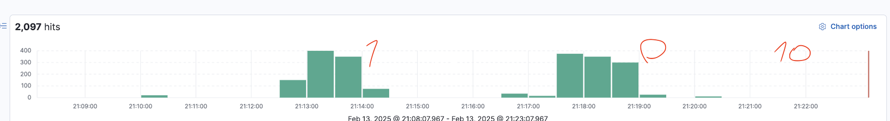
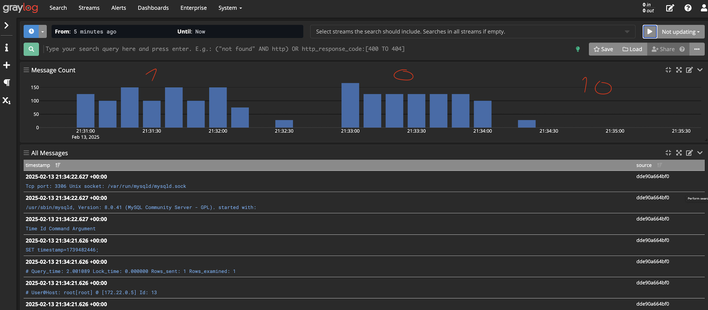

# Projector HSA Home work #15: Logging

## To run the ELK (Elasticsearch, Logstash, Kibana) project:

```bash
$ docker-compose -f docker-compose-elk.yml up
```

## To run the ELK (Elasticsearch, Logstash, Kibana) project:

```bash
$ docker-compose -f docker-compose-graylog.yml up
```

## To run the siege test:

```bash
chmod +x ./scripts/siege.sh
./scripts/siege.sh
```

## Then – visit Kibana or Graylog web interface:

- Kibana: http://localhost:5601
- Graylog: http://localhost:9000

## Or check screenshots:

### Kibana:



### Graylog:


